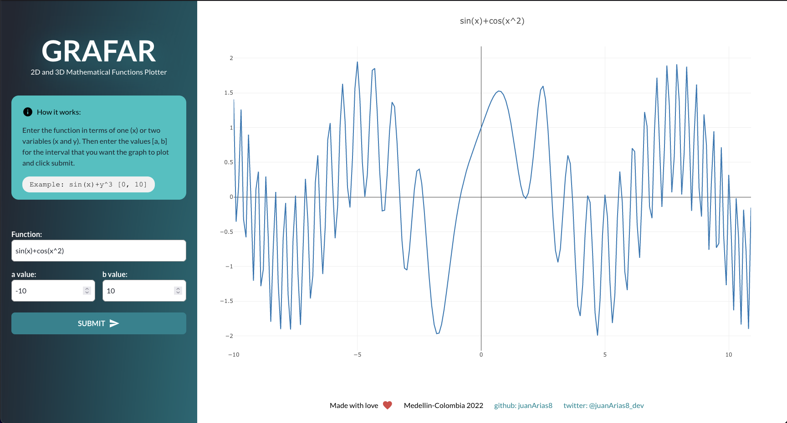
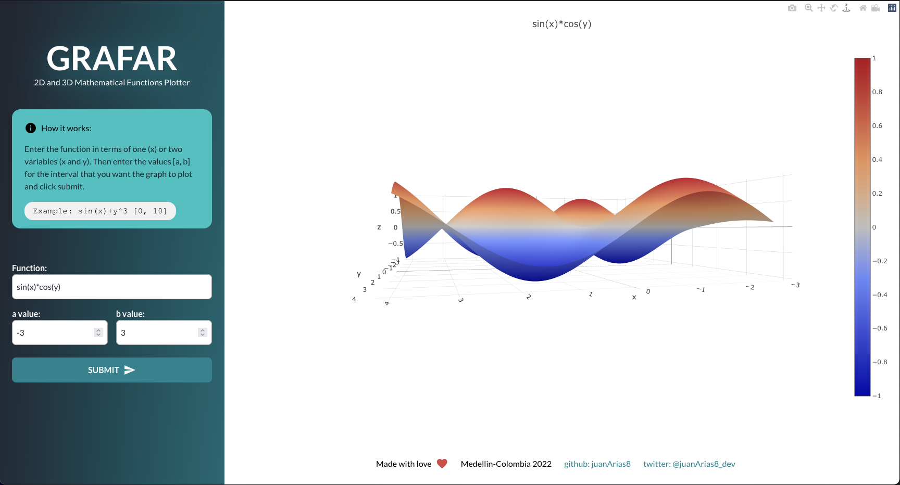
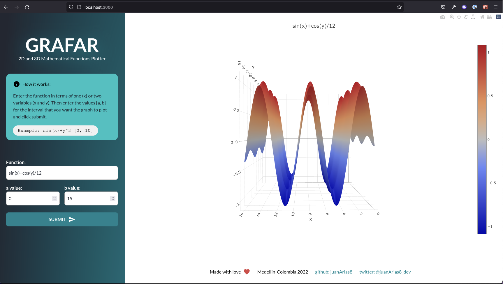
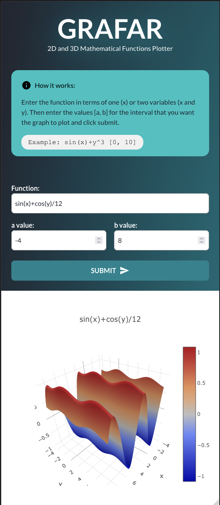

# GRAFAR

2D and 3D Mathematical Functions Plotter

# Posts 

1. [How to Plot Mathematical Functions in 10 Lines of Python](https://monadical.com/posts/plot-mathematical-functions-in-python.html)

# Screenshots 
* 2D plot  
  

* 3D plot  
  
  

* Responsive   
  
